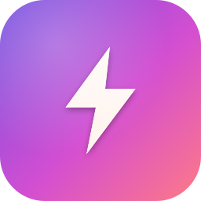

# GameBoost

A small, honest macOS app that frees up memory and quiets background noise before you launch a game. SwiftUI, no dependencies, ships as a double-clickable `.app`.

<p align="center">
  
</p>

## Why this exists

Most "Mac optimizer" apps sell things macOS doesn't actually let third parties touch — drivers, GPU tuning, kernel knobs. GameBoost only does things that **actually move the needle** on a Mac:

- Flush inactive memory pages (`purge`)
- Quit memory-hungry background apps (Chrome tabs, Electron stuff, Slack)
- Pause Spotlight indexing so disk + CPU aren't competing with your game
- Flip Do Not Disturb on
- Show you live memory pressure and CPU% so you can see whether any of it helped

That's it. No fake "driver update" tab. No placebo cleanup of 0.3 GB of "junk files."

## Features

- **Sidebar navigation** — a macOS-native `NavigationSplitView` sidebar switches between Dashboard, Game Profiles, Graphics, and Settings, with a live CPU / pressure / thermal readout pinned to the bottom.
- **Launch at login** — optional, via the modern `SMAppService` API, so the menu-bar icon is ready right after you log in.
- **⌘B One-click Boost** — a menu command + keyboard shortcut for boosting without touching the mouse.
- **Menu bar mode** — a status-bar item shows live CPU%, with a popover holding mini stats, a CPU sparkline, One-click Boost, and quick-launch buttons for your game profiles. The app keeps running in the background; click "Open dashboard" any time.
- **Real FPS overlay** — game profiles can launch with Apple's built-in Metal Performance HUD (`MTL_HUD_ENABLED`), giving a true in-game FPS / frame-time / GPU-memory overlay with no injection or hacks (Metal-rendering games only).
- **Game-library auto-detect** — scan your Steam library (parses the `.acf` manifests) and game-tagged apps in Applications, then add any of them as a profile in one tap.
- **Session & playtime stats** — every profile launch is timed; the Stats tab shows total playtime, this-week, per-game totals, and recent sessions.
- **Boost receipts** — after a boost, see the measured result: RAM reclaimed, memory-pressure before→after, and how many apps were quit. Proof, not vibes.
- **Game profiles** — point GameBoost at a game's `.app`, choose what to do when you launch it (purge RAM, pause Spotlight, enable DND, quit specific apps, FPS overlay), then launch the game + apply the boost in one click.
- **Auto-restore** — when the launched game quits, GameBoost automatically resumes Spotlight and turns DND back off. No need to remember to undo anything.
- **Live charts** — 60-second rolling memory-pressure and CPU% area charts, sampled every 1.5 s via `host_statistics64` / `HOST_CPU_LOAD_INFO`.
- **Memory stats** — total, used, inactive, compressed, pressure %, color-coded.
- **Running-apps list** — sorted by RSS, multi-select + quit, with lock indicators on system processes (Finder, Dock, etc.) so you can't accidentally kill them.
- **Customizable One-click Boost** — choose exactly what the button does (free RAM, pause Spotlight, toggle DND, and/or quit apps over a memory threshold). Settings persist.
- **Graphics advisor** — detects your chip, GPU cores, RAM, and display, then suggests tiered in-game settings (resolution/render scale, textures, shadows, AA, target FPS, V-Sync) with reasoning.
- **Thermal monitor** — live thermal-state readout (`ProcessInfo.thermalState`) with a throttling warning. When the chip hits "Throttling"/"Critical", your frame rate is being actively capped — this is the most relevant gaming signal on a Mac.
- **Power / battery awareness** — detects battery vs AC and Low Power Mode (`IOPSCopyPowerSourcesInfo`), and warns when you're on battery or in Low Power Mode, both of which throttle GPU/CPU hard.
- **Keep display awake** — a toggle that holds an `IOPMAssertion` so the screen won't sleep mid-game when you're on a controller and the keyboard's idle.
- **CPU% column + sort** — the running-apps list shows live CPU% per app and can sort by CPU or memory, so you can see what's actually stealing cycles.
- **Toggle switches** — Spotlight and Do Not Disturb are real on/off switches that reflect live state, not fire-and-forget buttons.
- **Activity log** — every action timestamped so you know what actually ran.
- **Dark, polished UI** — gradient header, card-based stats, monospaced digits everywhere.

## Game profiles & auto-restore

The **Game Profiles** section (and the menu bar popover) let you save a per-game boost:

1. Click **Add game** and pick a game from `/Applications` (or anywhere).
2. Toggle what should happen on launch — free memory, pause Spotlight, DND, and which background apps to quit first.
3. Leave **Auto-restore** on so Spotlight + DND revert automatically when the game closes.
4. Hit **Launch** — GameBoost applies the boost, opens the game, and arms auto-restore.

Profiles are stored as JSON in `~/Library/Application Support/GameBoost/profiles.json`.

> Note: auto-restore resuming Spotlight re-runs `mdutil` (admin), so macOS may prompt for your password again when the game quits. DND restore needs no admin.

## Customizing One-click Boost

Hit the gear button next to **One-click Boost** to pick what it runs:

- Free inactive memory (`purge`)
- Pause Spotlight indexing
- Turn on Do Not Disturb
- Quit memory-hungry apps above a threshold you set (250 MB – 4 GB)

The caption under the button always shows the current recipe, and the choice is saved across launches.

## Graphics advisor

The **Graphics** section detects your hardware and suggests in-game settings as a starting point:

| Detected | Source |
| --- | --- |
| Chip + CPU cores | `sysctl` (`machdep.cpu.brand_string`, `hw.physicalcpu`, `hw.optional.arm64`) |
| GPU name + VRAM/working set | Metal (`MTLCreateSystemDefaultDevice`) |
| GPU core count (Apple Silicon) | `system_profiler SPDisplaysDataType` |
| Display resolution + refresh | `NSScreen` (backing pixels + `maximumFramesPerSecond`) |

It buckets the Mac into Low / Medium / High / Ultra (mostly from GPU cores, capped by RAM) and recommends resolution/render scale, texture quality, shadows, anti-aliasing, effects, target FPS, and V-Sync — each with a short reason.

> These are **honest hardware-tier guesses, not per-game profiles.** Setting names differ between games; match the intent. On Apple Silicon it nudges you toward MetalFX upscaling instead of brute-forcing native 4K/5K.

## Screenshots

> Add a screenshot here after first launch — drop a PNG in `docs/` and reference it as `docs/screenshot.png`.

## Install

### Option A — download a release

Grab `GameBoost-x.y.z.zip` from the [Releases page](https://github.com/morgang213/gameboost/releases), unzip, and drag `GameBoost.app` to `/Applications`.

First launch from Finder may require **right-click → Open** (the bundle is ad-hoc signed, not notarized).

### Option B — build it yourself

```bash
git clone https://github.com/morgang213/gameboost.git
cd gameboost
./build-app.sh            # build GameBoost.app
./build-app.sh --zip      # also produce dist/GameBoost-x.y.z.zip
cp -R dist/GameBoost.app /Applications/
open /Applications/GameBoost.app
```

### Option C — run from source (no bundle)

```bash
swift run -c release GameBoost
```

> Launch-at-login only works from the bundled `.app`, not from `swift run`.

## Build

Everything is a Swift Package — no Xcode project required.

```bash
./build-app.sh        # generates icon, builds release binary, assembles + signs GameBoost.app
swift build -c release # binary only, no bundle
swift tools/make-icon.swift  # regenerate the .icns from scratch
```

Output:

- `dist/GameBoost.app` — the bundle
- `Resources/GameBoost.icns` — the generated icon
- `.build/release/GameBoost` — raw binary

## Requirements

- macOS 13 (Ventura) or later
- Swift 5.9+ toolchain (ships with Xcode 15 / Command Line Tools)
- Admin password the first time you hit **Free inactive memory** or **Pause Spotlight indexing** (those shell out to `purge` and `mdutil` via `osascript … with administrator privileges`)
- For one-click Do Not Disturb toggling: macOS 13+ ships Shortcuts named **"Turn On Do Not Disturb"** and **"Turn Off Do Not Disturb"** — if they're missing the app opens Focus settings as a fallback.

## What it actually does under the hood

| Action | Mechanism |
| --- | --- |
| Memory stats | `host_statistics64` + `HOST_VM_INFO64` |
| CPU usage | `host_statistics` + `HOST_CPU_LOAD_INFO`, delta between samples |
| Per-app CPU% / RAM | `ps -axo pid=,rss=,%cpu=` |
| Thermal state | `ProcessInfo.thermalState` |
| Power / battery | `IOPSCopyPowerSourcesInfo` + `ProcessInfo.isLowPowerModeEnabled` |
| Keep display awake | `IOPMAssertionCreateWithName` (PreventUserIdleDisplaySleep) |
| Launch at login | `SMAppService.mainApp` (ServiceManagement) |
| Free inactive memory | `osascript -e 'do shell script "/usr/sbin/purge" with administrator privileges'` |
| Pause/resume Spotlight | `mdutil -a -i off/on` (admin) |
| Toggle DND | `shortcuts run "Turn On Do Not Disturb"` |
| List running apps | `NSWorkspace.shared.runningApplications` + `ps -axo pid=,rss=` |
| Quit app | `NSRunningApplication.terminate()` |
| Launch game profile | `NSWorkspace.openApplication(at:configuration:)` |
| FPS overlay | `MTL_HUD_ENABLED=1` via the launch configuration's environment |
| Steam library scan | parse `~/Library/Application Support/Steam/steamapps/*.acf` |
| Native game detection | `LSApplicationCategoryType == public.app-category.games` |
| Session tracking | launch time + `didTerminateApplicationNotification`, stored as JSON |
| Auto-restore trigger | `NSWorkspace.didTerminateApplicationNotification` |
| Menu bar item | `NSStatusItem` + `NSPopover` hosting SwiftUI |
| Uptime / CPU model | `sysctl` (`kern.boottime`, `machdep.cpu.brand_string`) |

## What it deliberately does NOT do

- **Update or tune drivers.** macOS has no user-tunable drivers. Any app claiming otherwise is lying.
- **"Clean junk files."** That category of cleaner is mostly placebo and risks deleting things you want.
- **Force-enable Game Mode.** macOS owns this — it auto-activates when a fullscreen game launches. No third-party app can flip it on.
- **Run as a daemon, login item, or anything persistent.** It's a launch-it-when-you-want-it app.

## Project layout

```
Package.swift              Swift Package definition
build-app.sh               Builds + bundles + ad-hoc signs GameBoost.app
tools/make-icon.swift      Generates GameBoost.icns from scratch with Core Graphics
Sources/GameBoost/
  main.swift               Entry point, App scene, AppDelegate (menu bar)
  AppState.swift           Shared ObservableObject: stats, actions, profile launch, auto-restore
  ContentView.swift        Sidebar nav + Dashboard UI
  Profiles.swift           Profile list + editor sheet
  MenuBarController.swift   NSStatusItem + popover dashboard
  GameProfile.swift        Profile model + JSON persistence
  GameLibrary.swift        Steam + native game scanner
  SessionStore.swift       Play-session logging + Stats view
  SettingsStore.swift      One-click Boost config + Settings page (launch-at-login)
  GraphicsAdvisor.swift    Hardware detection + tiered settings advisor
  SystemStats.swift        host_statistics wrappers + CPUSampler
  SystemMonitors.swift     Thermal state, power/battery, keep-awake assertion
  AppManager.swift         Running-app enumeration + RSS/CPU lookup + quit
  Optimizer.swift          purge / mdutil / shortcuts wrappers
Resources/GameBoost.icns   (generated)
dist/GameBoost.app         (generated)
```

## Customizing

- **Icon** — edit colors or the bolt path in `tools/make-icon.swift`, rerun `./build-app.sh`.
- **Protected apps** — append bundle IDs to `protectedBundleIDs` in `Sources/GameBoost/AppManager.swift` to lock more apps from accidental quit.
- **Refresh rate** — change `refreshTimer` / `appsTimer` in `ContentView.swift`.
- **History window** — change `historyWindow` (default 60 s) for longer charts.

## License

MIT — see [LICENSE](LICENSE).
